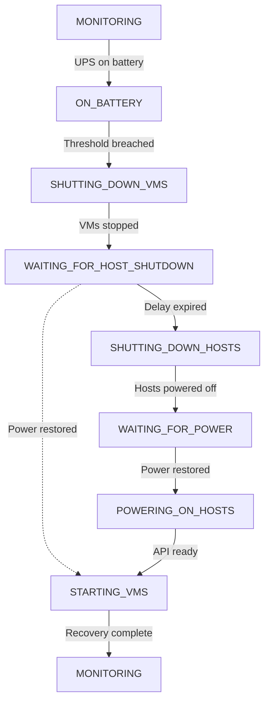

# hypercore-power-manager

Graceful UPS-driven shutdown and recovery for Scale Computing HyperCore clusters, orchestrated via NUT, the HyperCore REST API, and IPMI.

## Overview

hypercore-power-manager is a daemon that monitors your UPS through a NUT server and automatically orchestrates graceful shutdown and recovery of Scale Computing HyperCore VMs and clusters. When the UPS switches to battery, it shuts down VMs via the HyperCore REST API, then powers off hosts via IPMI. When power returns, it brings everything back up in the correct order.

It's designed to run on a Raspberry Pi or similar low-power device that stays alive on UPS battery while it shuts down and recovers the infrastructure around it. It runs as a systemd service; install it, configure it, and forget about it until you need it.

## Features

- **Two-stage shutdown** — VMs are shut down first via the HyperCore REST API, then hosts are powered off via IPMI after a configurable delay
- **Abort window** — if power restores before hosts are shut down, VMs are restarted automatically and no unnecessary outage occurs
- **Automatic recovery** — powers hosts back on via IPMI, waits for HyperCore API availability, then restarts VMs that were running before the shutdown
- **Multi-cluster support** — manages multiple independent HyperCore clusters, whether single-node or multi-node
- **NUT-based monitoring** — polls UPS status through a NUT server, supporting any UPS hardware that NUT supports
- **Systemd integration** — runs as a managed service with journal logging
- **Idempotent installer** — `scripts/install.sh` handles fresh installs and upgrades

## Prerequisites

- **NUT server** monitoring your UPS, accessible over the network
  (see the [NUT documentation](https://networkupstools.org/docs/user-manual.chunked/Configuration_notes.html)
  for setup — the daemon connects to NUT over TCP, so it can run on the same
  host as the NUT server or a different one)
- **Scale Computing HyperCore** cluster(s) with REST API access
- **IPMI access** to each HyperCore host (Dell iDRAC, Lenovo XClarity, HPE iLO,
  etc.) — IPMI over LAN must be enabled on each BMC. This is currently the only
  method used for host power control; REST API-based shutdown is planned for a
  future release.
- **A Linux host** to run the daemon, on UPS battery power so it stays alive
  during outages (a Raspberry Pi or similar low-power device is ideal)
- **Python 3.11+** (tested on 3.13)
- **[uv](https://docs.astral.sh/uv/)** package manager

## Installation

Clone the repository and run the install script:
```bash
git clone https://github.com/wijits36/hypercore-power-manager.git
cd hypercore-power-manager
sudo scripts/install.sh
```

The [install script](scripts/install.sh) is idempotent, so it is safe to run on both fresh
installs and upgrades. It does the following:

1. Creates a dedicated `hcpowermgr` system user (no home directory, no login shell)
2. Copies the project to `/opt/hypercore-power-manager/`
3. Runs `uv sync` to create a virtual environment and install dependencies
4. Creates `/etc/hypercore-power-manager/` with restricted permissions
5. Copies `config.example.yaml` as a starting template (will not overwrite an existing config)
6. Installs the systemd service file to `/etc/systemd/system/`
7. Runs `systemctl daemon-reload`

After installation, edit the config and start the service:
```bash
# Edit the config with your preferred editor
sudo nano /etc/hypercore-power-manager/config.yaml
sudo systemctl enable --now hypercore-power-manager
```

## Configuration

The config file lives at `/etc/hypercore-power-manager/config.yaml`. The install
script copies [config.example.yaml](config.example.yaml) as a starting template
with inline comments explaining the fields.

The config has three sections:

**nut** — Connection details for your NUT server (host, port, UPS name, polling
interval). If the daemon runs on the same host as the NUT server, use `localhost`.

**clusters** — A list of HyperCore clusters to manage. Each cluster needs its REST
API URL and credentials, along with a list of nodes and their IPMI credentials.
Single-node and multi-node clusters are both supported. Use IP addresses instead
of hostnames — during a power event, your DNS server may lose power before the
UPS is exhausted, making hostnames unresolvable.

**thresholds** — Battery percentage and estimated runtime thresholds that trigger
shutdown, plus the delay between VM shutdown and host power-off (the abort
window). While on battery, shutdown is triggered when *either* threshold is
breached.

Both `battery_percent` and `runtime_seconds` are UPS firmware estimates derived
from the same internal voltage curve modeling; they are not independent
measurements. UPS charge reporting becomes increasingly unreliable as batteries
age; in testing, a UPS reported 59% charge and then died moments later. The
defaults (80% / 600 seconds) are aggressive by design: a false-positive shutdown
is recoverable, but a missed shutdown risks data loss. `runtime_seconds` is the
only load-aware threshold; it catches scenarios where an undersized UPS shows
healthy charge but has very little actual runtime remaining under load.

The log level defaults to INFO and can be changed with the `--log-level` flag
(see [Usage](#usage)). Logs go to the systemd journal when running as a service.

You will need the following credentials before configuring:

- NUT server host and UPS name (run `upsc <ups_name>@<host>` to verify)
- HyperCore REST API URL and admin credentials for each cluster
- IPMI/BMC IP address, username, and password for each physical host

## Usage

### Running as a service

The standard way to run the daemon is as a systemd service:
```bash
# Start and enable at boot
sudo systemctl enable --now hypercore-power-manager

# Check status
sudo systemctl status hypercore-power-manager

# View logs
sudo journalctl -u hypercore-power-manager -f
```

### Running manually

For testing or debugging, you can run the daemon directly:
```bash
/opt/hypercore-power-manager/.venv/bin/python -m hypercore_power_manager \
    --config /etc/hypercore-power-manager/config.yaml \
    --log-level DEBUG
```

This runs in the foreground and logs to the terminal. Press `Ctrl+C` to stop.

## How It Works

The daemon runs a polling loop that checks UPS status through the NUT server.
Under normal conditions, it confirms the UPS is online and does nothing. When a
power event occurs, it walks through a shutdown and recovery sequence:

1. **Power goes out** — the UPS switches to battery and the daemon detects the
   `OB` (on battery) status flag from NUT.
2. **Thresholds are monitored** — the daemon watches battery percentage and
   estimated runtime. As long as both remain above the configured thresholds,
   it stays in a holding pattern. If power returns now, the daemon resumes
   normal monitoring — the UPS handled it.
3. **Shutdown triggered** — when either threshold is breached, the daemon begins
   graceful VM shutdown across all configured clusters via the HyperCore REST
   API. Once this begins, it runs to completion even if power restores — there
   is no safe way to partially reverse a VM shutdown sequence.
4. **VMs stop** — the daemon waits for all VMs to reach a stopped state, up to
   the configured `vm_shutdown_timeout` per cluster. Any VM that does not shut
   down gracefully within this window is force-stopped.
5. **Abort window** — after all VMs are stopped, the daemon waits for
   `host_shutdown_delay` seconds before powering off hosts. If power restores
   during this window, the daemon skips host shutdown and jumps straight to
   restarting VMs. No unnecessary outage.
6. **Hosts power off** — if power has not returned, the daemon sends IPMI
   power-off commands to each host. The hosts go down; the daemon (running on
   a separate device still on UPS battery) stays alive and waits.
7. **Power returns** — the daemon detects the UPS is back online (`OL` status
   flag) and sends IPMI power-on commands to each host.
8. **Recovery** — the daemon waits for each host's HyperCore REST API to become
   reachable (up to `host_boot_timeout`), then restarts the VMs that were
   running before the shutdown. HyperCore preserves each VM's last power
   state — since the daemon shut them down gracefully, their last state is
   "off," so the daemon must explicitly restart them.

### State reference

| State | Description |
|---|---|
| `MONITORING` | UPS is on line power. Normal operation. |
| `ON_BATTERY` | UPS is on battery. Monitoring thresholds. |
| `SHUTTING_DOWN_VMS` | Sending shutdown commands to VMs via HyperCore REST API. |
| `WAITING_FOR_HOST_SHUTDOWN` | Abort window. Waiting before sending IPMI power-off. |
| `SHUTTING_DOWN_HOSTS` | Sending IPMI power-off commands to all hosts. |
| `WAITING_FOR_POWER` | Hosts are off. Waiting for line power to return. |
| `POWERING_ON_HOSTS` | Sending IPMI power-on and waiting for HyperCore API. |
| `STARTING_VMS` | Restarting VMs that were running before shutdown. |

### State diagram


## Troubleshooting

Check the daemon's logs for error messages:
```bash
sudo journalctl -u hypercore-power-manager -f
```

**Can't connect to NUT server** — Verify the NUT server is reachable and
listening on the configured host and port. Test with `upsc <ups_name>@<host>`.
If the NUT server is on a different host, make sure `upsd.conf` includes a
`LISTEN` directive for the network interface (not just `localhost`), and that
TCP port 3493 is not blocked by a firewall.

**HyperCore API authentication failures** — Verify the REST API URL and
credentials are correct. The URL should include the scheme
(e.g., `https://<cluster-ip>`). The daemon disables TLS verification by default.

**IPMI connection failures** — Verify the BMC IP address, username, and password
are correct. IPMI over LAN must be enabled on each host's BMC. Test with
`ipmitool -I lanplus -H <bmc_ip> -U <user> -P <pass> power status`.

**Daemon starts but takes no action on battery** — Check that the UPS name in
the config matches the NUT UPS name, and that thresholds are set appropriately.
Run with `--log-level DEBUG` to see every poll cycle and threshold check.

## Roadmap

Planned for future releases:

- **REST API cluster shutdown** — use the HyperCore REST API as the primary
  shutdown method, with IPMI as a fallback. This will make IPMI optional for
  environments where it is not available.
- **OIDC authentication** — support for HyperCore clusters that use OIDC instead
  of local credentials.
- **BIOS power policy awareness** — detect whether hosts are configured to
  "always on" or "last state" and adjust recovery behavior accordingly.

## License

This project is licensed under the MIT License. See [LICENSE](LICENSE) for details.
